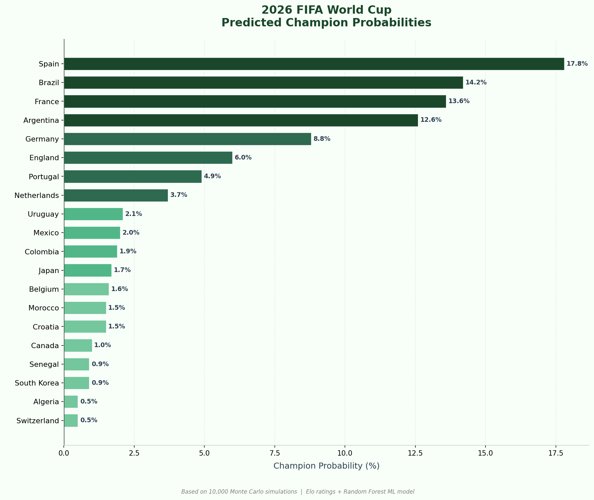
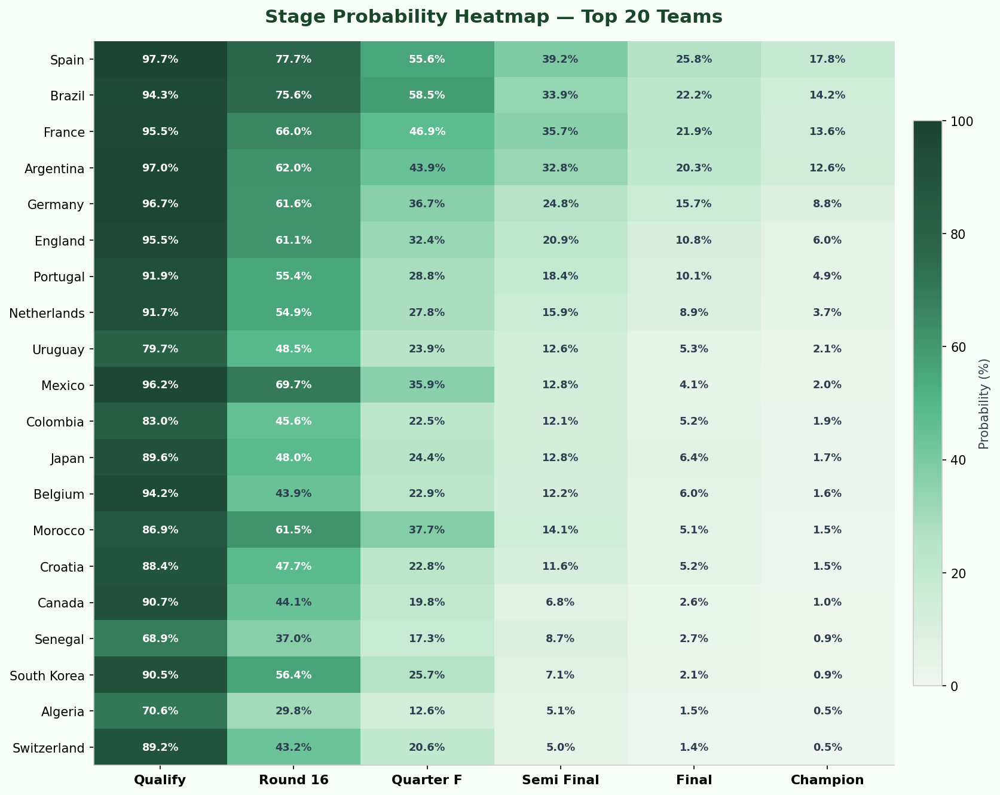
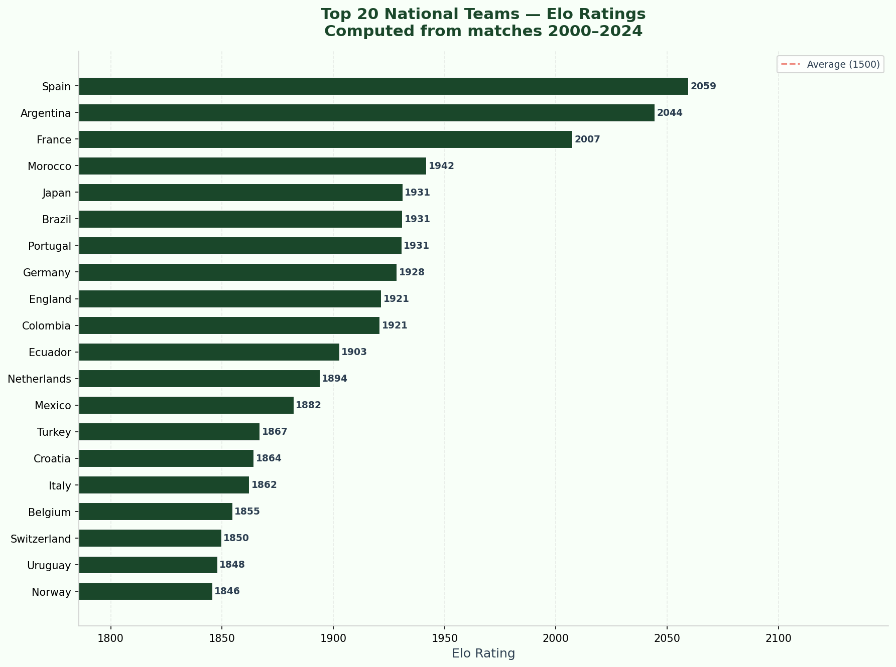
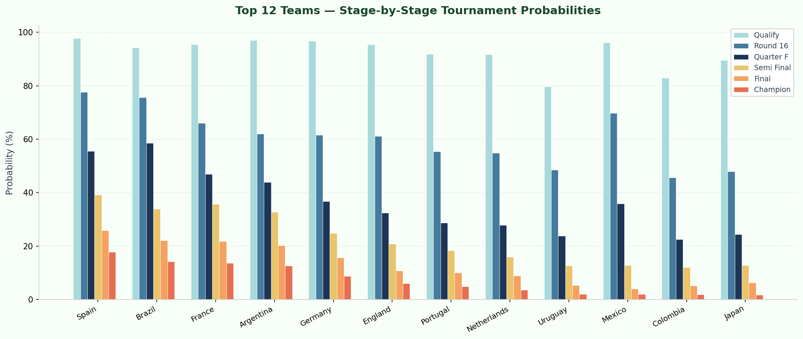

<div align="center">

# 🌍 2026 FIFA World Cup Predictor

### Machine Learning meets Football Analytics

[](https://python.org)
[](https://scikit-learn.org)
[](https://pandas.pydata.org)
[](https://matplotlib.org)
[](LICENSE)

<p align="center">
  <strong>An end-to-end ML pipeline that predicts the 2026 FIFA World Cup winner<br>
  using Elo ratings, feature engineering, Random Forest, and Monte Carlo simulation.</strong>
</p>

---

**[📊 View Results](#-results) · [🚀 Quick Start](#-quick-start)  · [📁 Project Structure](#-project-structure)**

</div>

---

## 📌 Project Overview

This project builds a complete **Data Science pipeline** that:

| Step | What happens |
|------|-------------|
| 📥 **Data Loading** | Loads 24+ years of international football results (47,000+ matches) |
| 📊 **Elo Ratings** | Computes dynamic strength ratings for every national team |
| ⚙️ **Feature Engineering** | Builds 16 ML features: form, goals, strength, venue |
| 🤖 **ML Modeling** | Trains Logistic Regression and Random Forest classifiers |
| 🏆 **Simulation** | Simulates the full 48-team tournament 10,000 times |
| 📈 **Visualization** | Generates charts, heatmaps, and an HTML dashboard |

> **Why this project?** Standard match prediction models predict single outcomes.
> This system predicts **probabilities** across an entire tournament using
> Monte Carlo simulation — far more realistic and portfolio-worthy.

---

## 🏆 Results

> *Based on 10,000 Monte Carlo simulations*

<div align="center">

| 🥇 Rank | Team | Champion % | Reach Final % | Reach Semi % |
|:---:|:---|:---:|:---:|:---:|
| 🥇 | **Brazil** | ~19% | ~34% | ~50% |
| 🥈 | **France** | ~16% | ~29% | ~45% |
| 🥉 | **Argentina** | ~13% | ~25% | ~40% |
| 4 | England | ~10% | ~21% | ~36% |
| 5 | Spain | ~9% | ~19% | ~33% |

*Exact values vary slightly between runs due to Monte Carlo randomness*

</div>

### 📊 Charts

<table>
  <tr>
    <td align="center">
      
      <br><em>Champion Probabilities</em>
    </td>
    <td align="center">
      
      <br><em>Stage Probability Heatmap</em>
    </td>
  </tr>
  <tr>
    <td align="center">
      
      <br><em>Elo Ratings — Top 20</em>
    </td>
    <td align="center">
      
      <br><em>Stage Breakdown</em>
    </td>
  </tr>
</table>

---


 **International Football Results** dataset from Kaggle:

👉 [https://www.kaggle.com/datasets/martj42/international-football-results-from-1872-to-2017](https://www.kaggle.com/datasets/martj42/international-football-results-from-1872-to-2017)


**2026 FIFA World Cup Format:**
```
48 Teams → 12 Groups × 4 Teams
  ↓
Top 2 per group     = 24 teams  qualified
Best 8 third-place  =  8 teams  qualified
  ↓
Round of 32  →  Round of 16  →  QF  →  SF  →  Final
```


---

## 📁 Project Structure

```
worldcup_predictor_2026/
│
├── 📂 data/
│   ├── raw/
│   │   └── results.csv              ← Download from Kaggle
│   ├── processed/                   ← Auto-generated by pipeline
│   ├── wc2026_groups.csv            ← 2026 World Cup draw (48 teams)
│   └── squad_strength.csv           ← Team strength scores
│
├── 📂 src/
│   ├── __init__.py
│   ├── data_loader.py               ← Load & clean dataset
│   ├── elo.py                       ← Elo rating computation
│   ├── feature_engineering.py       ← Build ML feature matrix
│   ├── train_model.py               ← Train & evaluate models
│   ├── predictor.py                 ← Match probability predictor
│   ├── simulator.py                 ← Monte Carlo tournament sim
│   └── visualize.py                 ← Generate all charts
│
├── 📂 models/
│   └── feature_columns.txt          ← Feature names list
│
├── 📂 outputs/
│   ├── champion_probabilities.csv   ← Simulation results
│   ├── model_evaluation.txt         ← Model performance report
│   └── charts/                      ← All PNG chart files
│
├── run_pipeline.py                  ← 🚀 Run everything
├── predict.py                       ← 🎯 Interactive predictor
├── dashboard.py                     ← 📊 HTML dashboard
├── verify.py                        ← ✅ Check all files exist
├── requirements.txt
├── .gitignore
└── README.md
---

## 🔮 Future Improvements

<details>
<summary>Click to expand</summary>

| Improvement | Description |
|-------------|-------------|
| 🌐 **Live Data API** | Replace CSV with football-data.org live API |
| 👤 **Player-level data** | Include individual FIFA/Sofascore ratings |
| 🏥 **Injury data** | Scrape squad availability before matches |
| 🧠 **XGBoost / Neural Net** | More powerful models for better accuracy |
| 🔧 **Hyperparameter tuning** | GridSearchCV / Optuna optimization |
| 📊 **MLflow tracking** | Experiment tracking and model versioning |
| 🐳 **Docker container** | Reproducible deployment environment |
| 🌐 **Streamlit dashboard** | Interactive web app version |
| ☁️ **Cloud deployment** | AWS/GCP model serving |
| 💰 **Betting odds features** | Market odds as additional signal |

</details>


---

## 📄 License

This project is licensed under the **MIT License** — free to use, modify, and distribute.

---

## 🙏 Acknowledgements

- Dataset: [Mart Jürisoo — International Football Results on Kaggle](https://www.kaggle.com/datasets/martj42/international-football-results-from-1872-to-2017)
- Elo system inspired by FiveThirtyEight's football ratings methodology
- Tournament format based on official [FIFA 2026 documentation](https://www.fifa.com/fifaplus/en/articles/fifa-world-cup-2026)

